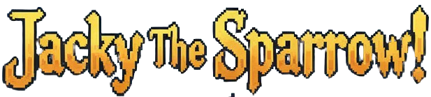

  

## Descripción

Jacky The Sparrow es un juego plataformero 2D Desarrollado con Godot, cuenta con 4 enemigos, un personaje principal (Jacky!) y un mapa de 2 niveles desafiantes.

## Controles

Movimiento con las flechitas y salto con barra espaciadora, para doble salto presionar dos veces la barra.
Jacky cuenta con 3 vidas.
